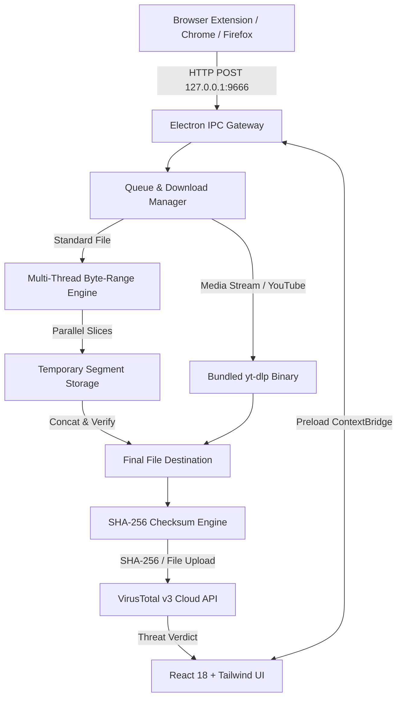

# MDM

<p align="center">
  
</p>

<p align="center">
  <b>The modern, open-source download manager I built because I refused to pay for IDM.</b>
</p>

<p align="center">
  
  
  
  
  
</p>


<br>
<div align="center">
  <h2>
    <a href="https://okayabedin.github.io/MDM-Download-Manager/">
      DOWNLOAD MDM
    </a>
  </h2>
</div>
<br>


## Why I Built This

Like pretty much everyone who downloads files on Windows, I used **Internet Download Manager (IDM)** for years. 

Credit where credit is due: IDM was fast. It sliced files into byte ranges, maxed out network bandwidth, and grabbed media links before the browser could even start buffering.

**However, two major issues remained:**
1. **The interface never evolved.** In an era of clean dark modes and refined design systems, IDM still looked like a Windows 98 utility.
2. **The perpetual 30-day trial popups.** *"Your trial has expired. Enter a serial key."* I wasn't going to pay for software that hasn't refreshed its interface in twenty years, nor did I want to run unverified patches on my personal machine.

So I built **MDM (Minhaz's Download Manager)**: a high-performance download accelerator that supports up to 32 parallel streams, grabs 4K streaming media via `yt-dlp`, automatically checks downloads against 70+ antivirus engines using VirusTotal, and features a clean Supabase/Linear-inspired dark interface.

---

## Key Features

### 1. Multi-Stream Acceleration (1 to 32 Threads)
Instead of downloading files sequentially, MDM splits HTTP/HTTPS transfers into up to **32 parallel byte-range connections**, maximizing throughput and merging segments automatically upon completion.

### 2. Built-in VirusTotal Cloud Scanner
- Configure your free personal VirusTotal API key in **Settings > Security & VirusTotal**.
- Calculates the file's SHA-256 hash upon completion and checks **70+ cloud antivirus engines** (Kaspersky, Microsoft Defender, Bitdefender, CrowdStrike) without re-uploading file data.
- Automatically uploads uncataloged files for direct scanning.

### 3. Universal Media Grabber (`yt-dlp` Powered)
An embedded, standalone `yt-dlp` engine extracts video and audio streams from YouTube and streaming sites in 4K, 1080p, or 720p with zero external Python requirements.

### 4. Browser Extension (Chrome, Edge, Brave, Firefox)
- Automatically intercepts browser downloads and routes them directly into MDM.
- Displays an auto-fading, dismissible **Download with MDM** button on web video players.

### 5. Modern Desktop Interface
- **Native Title Bar Sync**: Synchronizes with Windows 10/11 dark and light modes.
- **Secondary Sidebar Navigation**: Dedicated categorized preferences panel for clean organization.
- **Live Stream Inspector & Speed Graph**: Real-time throughput graph and per-stream thread progress visualization.

---

## Comparison

| Feature | Browser Default | Legacy IDM / FDM | MDM |
| :--- | :---: | :---: | :---: |
| **Speed Acceleration** | Single stream | Up to 8/16 connections | **1 to 32 Parallel Byte-Range Streams** |
| **Interface** | Basic | Windows 98 legacy | **Modern Supabase / Linear Dark UI** |
| **Cloud Antivirus Scan** | None | None | **Built-in VirusTotal SHA-256 & Upload Scanner** |
| **Streaming Media Extraction** | None | Web hooks | **Native Embedded `yt-dlp` Pipeline** |
| **Trial / Nag Screens** | None | 30-day serial nag popups | **100% Free & Open-Source (GPLv3)** |
| **Privacy & Telemetry** | Browser telemetry | Closed source | **100% Local Loopback (127.0.0.1:9666)** |

---

## Architecture



---

## Getting Started

### 1. Download Binary
Pre-compiled binaries are available on the [Releases](https://github.com/okayabedin/MDM-Download-Manager/releases) page:
- **`MDM - Download Manager 1.0.0.exe`**: Standalone single-file portable executable (no installer required).
- **`MDM - Download Manager Setup 1.0.0.exe`**: Standard Windows installer with start menu and desktop shortcuts.

### 2. Install Browser Extension
1. Open your browser extension manager (`chrome://extensions` or `edge://extensions`).
2. Enable **Developer mode** in the top right corner.
3. Click **Load unpacked** and select the `extension/` directory from this repository.
4. *(Firefox: navigate to `about:debugging` and load `extension/manifest.json`)*.

### 3. Configure VirusTotal (Optional)
1. Obtain a free personal API key from [VirusTotal](https://www.virustotal.com/gui/my-apikey).
2. Open MDM, navigate to **Settings > Security & VirusTotal**, paste your key, and click **Verify Key**.
3. Enable **Automatic Antivirus Scan on Complete**.

---

## Building from Source

```bash
# 1. Clone repository
git clone https://github.com/your-username/mdm.git
cd mdm

# 2. Install dependencies
npm install

# 3. Start development server
npm run dev

# 4. Build Portable Executable
./build-portable.sh
# or: npm run dist:portable

# 5. Build Windows Setup Installer
./build-installer.sh
# or: npm run dist:installer
```

Output binaries are generated in `release/`:
- `release/MDM - Download Manager 1.1.2.exe` (Portable)
- `release/MDM - Download Manager Setup 1.1.2.exe` (Windows Installer)

---

## Privacy & Security

- **No Telemetry**: No analytics or user tracking.
- **Local Gateway**: The browser extension connects exclusively to `http://127.0.0.1:9666` bound locally.
- **Direct API Communication**: VirusTotal checks run directly through your personal API key without third-party intermediaries.

---

## License

Distributed under the **GNU General Public License v3 (GPLv3)**. See [LICENSE](LICENSE) for details.

---

<p align="center">
  Made by <a href="https://minhazabedin.vercel.app"><b>Minhaz</b></a>
</p>
